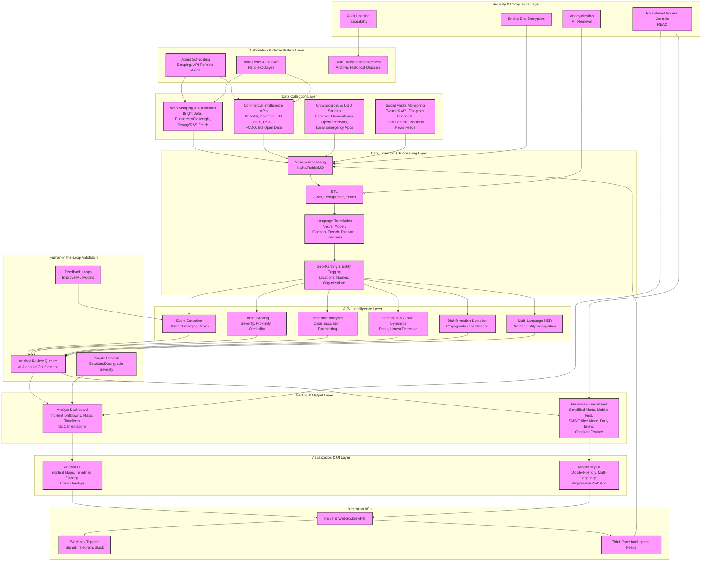

# Good Shepherd System Architecture Diagram

```mermaid
graph TB
    subgraph "Data Collection Layer"
        A1[Web Scraping & Automation<br/>Bright Data, Puppeteer/Playwright,<br/>Scrapy/RSS Feeds]
        A2[Commercial Intelligence APIs<br/>Crisis24, Dataminr, UN HDX, OSAC,<br/>FCDO, EU Open Data]
        A3[Crowdsourced & NGO Sources<br/>Ushahidi, Humanitarian OpenStreetMap,<br/>Local Emergency Apps]
        A4[Social Media Monitoring<br/>Twitter/X API, Telegram Channels,<br/>Local Forums, Regional News Feeds]
    end

    subgraph "Data Ingestion & Processing Layer"
        B1[Stream Processing<br/>Kafka/RabbitMQ]
        B2[ETL<br/>Clean, Deduplicate, Enrich]
        B3[Language Translation<br/>Neural Models<br/>German, French, Russian, Ukrainian]
        B4[Geo-Parsing & Entity Tagging<br/>Locations, Names, Organizations]
    end

    subgraph "AI/ML Intelligence Layer"
        C1[Event Detection<br/>Cluster Emerging Crises]
        C2[Threat Scoring<br/>Severity, Proximity, Credibility]
        C3[Predictive Analytics<br/>Crisis Escalation Forecasting]
        C4[Sentiment & Crowd Dynamics<br/>Panic, Unrest Detection]
        C5[Disinformation Detection<br/>Propaganda Classification]
        C6[Multi-Language NER<br/>Named Entity Recognition]
    end

    subgraph "Human-in-the-Loop Validation"
        D1[Analyst Review Queues<br/>AI Alerts for Confirmation]
        D2[Priority Controls<br/>Escalate/Downgrade Severity]
        D3[Feedback Loops<br/>Improve ML Models]
    end

    subgraph "Alerting & Output Layer"
        E1[Analyst Dashboard<br/>Incident Drilldowns, Maps, Timelines,<br/>SOC Integrations]
        E2[Missionary Dashboard<br/>Simplified Alerts, Mobile-First,<br/>SMS/Offline Mode, Daily Briefs,<br/>Check-In Feature]
    end

    subgraph "Security & Compliance Layer"
        F1[Role-Based Access Controls<br/>RBAC]
        F2[End-to-End Encryption]
        F3[Anonymization<br/>PII Removal]
        F4[Audit Logging<br/>Traceability]
    end

    subgraph "Automation & Orchestration Layer"
        G1[Agent Scheduling<br/>Scraping, API Refresh, Alerts]
        G2[Auto-Retry & Failover<br/>Handle Outages]
        G3[Data Lifecycle Management<br/>Archive, Historical Datasets]
    end

    subgraph "Visualization & UI Layer"
        H1[Analyst UI<br/>Incident Maps, Timelines, Filtering,<br/>Crisis Overlays]
        H2[Missionary UI<br/>Mobile-Friendly, Multi-Language,<br/>Progressive Web App]
    end

    subgraph "Integration APIs"
        I1[REST & WebSocket APIs]
        I2[Webhook Triggers<br/>Signal, Telegram, Slack]
        I3[Third-Party Intelligence Feeds]
    end

    A1 --> B1
    A2 --> B1
    A3 --> B1
    A4 --> B1
    B1 --> B2
    B2 --> B3
    B3 --> B4
    B4 --> C1
    B4 --> C2
    B4 --> C3
    B4 --> C4
    B4 --> C5
    B4 --> C6
    C1 --> D1
    C2 --> D1
    C3 --> D1
    C4 --> D1
    C5 --> D1
    C6 --> D1
    D1 --> E1
    D1 --> E2
    D2 --> E1
    D3 --> C1
    E1 --> H1
    E2 --> H2
    F1 --> E1
    F1 --> E2
    F2 --> B1
    F3 --> B2
    F4 --> G3
    G1 --> A1
    G1 --> A2
    G2 --> A1
    G2 --> A2
    H1 --> I1
    H2 --> I1
    I1 --> I2
    I1 --> I3
    I3 --> B1

    classDef layerClass fill:#f9f,stroke:#333,stroke-width:2px;
    class A1,A2,A3,A4,B1,B2,B3,B4,C1,C2,C3,C4,C5,C6,D1,D2,D3,E1,E2,F1,F2,F3,F4,G1,G2,G3,H1,H2,I1,I2,I3 layerClass;
```
