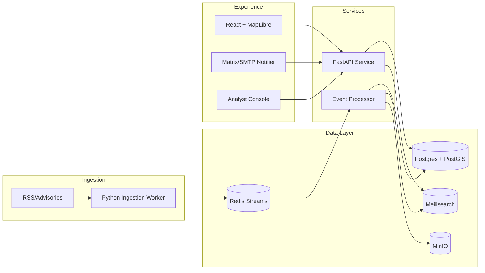

# Good Shepherd Blueprint

## Overview
Good Shepherd is a low-cost situational awareness and early warning platform built for missionary operations in Europe. It aggregates open-source intelligence, normalizes it into a geospatially aware data model, and exposes live and historical insights through an API, analyst workflows, and a map-based common operational picture.

- **Audience:** Mission agencies, field teams, security analysts.
- **Objective:** Deliver actionable daily briefings, alerts, and safe-movement guidance for less than $20/mo infrastructure spend.
- **Deployment Target:** Single DigitalOcean droplet (2 vCPU / 4 GB RAM) running a Docker Compose stack.

## Architecture at a Glance


## Component Responsibilities
  - Polls RSS feeds and advisories.
  - Normalizes entries into canonical event payloads.
  - Publishes payloads to Redis Streams with source metadata.
  - Reads a JSON-based `INGESTION_FEEDS` environment override or defaults to GDACS, USGS, and FCDO advisories.

- **Event Processor (`backend/processing/event_processor.py`)**
  - Performs geoparsing (Nominatim/Mordecai), deduplication, and confidence scoring.
  - Persists canonical events into Postgres/PostGIS.
  - Indexes searchable fields into Meilisearch (disabled when `MEILI_INDEXING_DISABLED=true`).
  - Stores large attachments (PDFs, images) in MinIO.
- **Verification (`backend/processing/verification.py`)**
  - Heuristic credibility scoring using trusted sources, category risk, and keyword signals.
  - Deduplicate events and maintain `verification_status`, `credibility_score`, and `threat_level` metadata.
  - Supports analyst overrides via repository helpers in `backend/database/repository.py`.

- **API Layer (`backend/processing/api_main.py`)**
  - FastAPI service exposing REST endpoints for search, alerts, and health checks.
  - Handles authentication (initially API key header), pagination, and filtering by geography/time.
  - Provides webhook endpoints for downstream alerting integrations.
  - `service.py` orchestrates report generation using recent events.
  - `sitrep_builder.py` synthesizes daily SITREPs with regional and threat summaries.
  - Persisted reports exposed through `/api/reports` endpoints for analyst review and distribution.

- **Frontend (`frontend/src/App.js`)**
  - React + MapLibre client rendering the common operational picture.
  - Displays clustered markers, event detail overlays, and timeline filters.
  - Offers analyst workflows (SITREP drafts, check-ins) in later iterations.
- **Infrastructure (`infrastructure/`)**
  - `docker-compose.yml`: Defines multi-service stack.
  - `Caddyfile`: Terminates TLS, routes subpaths to services, manages certificates via Let’s Encrypt.
  - `.env` (local-only): Secrets & configuration (never committed).

## Data Flow
1. **Acquire:** Scheduled worker pulls from configured feeds (GDACS, USGS, FCDO, etc.).
2. **Queue:** Events push into Redis Streams (`events.raw`).
3. **Process:** Event processor enforces schema, enriches with geospatial data, writes to Postgres (`events` table) and Meilisearch (`events` index).
4. **Serve:** FastAPI exposes `/api/search`, `/api/events/{id}`, `/api/alerts`.
5. **Visualize & Alert:** Frontend consumes API for COP; alerts service uses API/webhooks for Matrix/SMTP notifications.

## Configuration Highlights
- **Ingestion feeds (`INGESTION_FEEDS`)**
  - Optional JSON array of objects with `url`, `category`, `region`, and `enabled` keys.
  - Example:
    ```json
    [
      {"url": "https://www.gdacs.org/rss.xml", "category": "disaster"},
      {"url": "https://alerts.weather.gov/cap/us.php?x=0", "category": "weather", "region": "us"}
    ]
    ```
  - Omit to fall back to the default set (GDACS, USGS, FCDO).
- **Search indexing**
  - Configure Meilisearch via `MEILI_HTTP_ADDR`, `MEILI_API_KEY`/`MEILI_MASTER_KEY`, and `MEILI_INDEX` (default `events`).
  - Set `MEILI_INDEXING_DISABLED=true` to skip indexing in environments where Meilisearch is unavailable.
- **Geocoding**
  - Controlled by `GEOCODE_DISABLED` (set to `true` to skip requests) and `GEOCODE_RATE_LIMIT_SECONDS` for throttling.
  - Customize provider endpoint and headers with `GEOCODE_BASE_URL`, `GEOCODE_USER_AGENT`, and `GEOCODE_TIMEOUT`.

## Deployments & Environments
- **Production:** Single DO droplet (docker-compose). Nightly backups of Postgres & MinIO to DO Spaces.
- **Staging/Dev:** Optional local environment using docker-compose with mocked data sources.
- **CI/CD:** GitHub Actions (future) for linting, tests, and container builds.

## Security & Compliance
- Only open-source/public data ingested.
- No personal data stored; events limited to location, type, summary, and source references.
- API key authentication to secure non-public endpoints.
- SSL/TLS via Caddy + Let’s Encrypt; auto-renew every 60 days.

## Observability
- Structured logging (JSON) from worker and API.
- Metrics endpoint (`/metrics`) for Prometheus scraping (future stretch).
- Health endpoints (`/healthz`) to drive uptime monitoring.

## Alerting & Automation Roadmap
- **Phase 1 (Current)**
  - Manual analyst-triggered alerts using Matrix/SMTP scripts.
  - Daily SITREP generation via `POST /api/reports/generate` exposed in `backend/processing/api_main.py`.
- **Phase 2**
  - Background scheduler (Celery/APS) to auto-generate SITREPs at 0900 CET and queue them in MinIO.
  - Alert rules engine in `backend/alerts/` (planned) consuming Redis stream for high-threat events.
  - Webhook integrations for Matrix rooms and SMTP mailing lists with retry + failure logging.
  - Persist rules in Postgres via `AlertRuleRecord` and expose CRUD endpoints (preview `GET /api/alerts/rules`).
  - Secure mutation endpoints (`POST/PUT/DELETE /api/alerts/rules`) with `ADMIN_API_KEY` using `X-Admin-API-Key` header.
- **Phase 3**
  - Analyst console workflows for override/acknowledge, writing back to `backend/database/repository.py`.
  - Geo-fenced automation (per-country/per-team alert thresholds) stored in Postgres and editable via UI.
  - Escalation ladders with SLA timers feeding dashboard metrics (Grafana/Prometheus).
  - Frontend management panel in `frontend/src/App.js` (or a dedicated route) to list, create, edit, and delete rules via `/api/alerts/rules`.
- **Phase 4**
  - Bi-directional integrations (Signal/MS Teams) via event bus.
  - Automated safe-movement guidance: route computation triggered when alerts affect active missions.
  - Disaster drill simulations using archived events to test automation pipelines.

## Future Extensions
- Multi-language alert templates (EN/FR/DE).
- Route analysis overlay (OSM + hazard polygons).
- Mobile offline companion app for field teams.
- Federation/API sharing via STIX/TAXII for partner networks.
